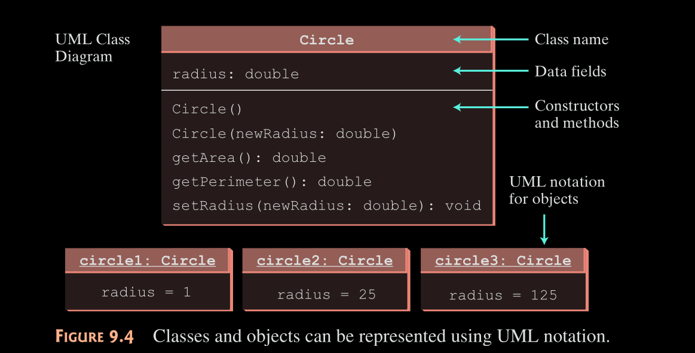

:PROPERTIES:
:ID:       ffe80d3b-b8d3-44b1-b628-aff04d5eccb8
:END:
#+title: Creating Classes
#+property: header-args :tangle code/ocp/6/creating_classes.java

* Creating Classes

A =class= is a blueprint that defines the ~properties~ (~attributes~) and ~behaviours~ (~methods~) of =objects=.
- This is a fundamental concept of [[id:f169a862-02f6-4ca9-a8b1-3de711c8ed10][Object Oriented Programming]].

- A =class= does *not* occupy *memory* until an ~object~ is *created* from it.
  - An =object= is an *instance* of a =class=.

- =Objects= are used to access the ~methods~ and ~variables~ defined in a =class=.

#+BEGIN_SRC java
class Circle {
    /** The radius of this circle */
    double radius = 1;

    /** Construct a circle object */
    Circle() {}

    /** Construct a circle object */
    Circle(double newRadius) {
        radius = newRadius;
    }

    /** Return the area of this circle */
    double getArea() {
        return radius * radius * Math.PI;
    }

    /** Return the perimeter of this circle */
    double getPerimeter() {
        return 2 * radius * Math.PI;
    }

    /** Set a new radius for this circle */
    void setRadius(double newRadius) {
        radius = newRadius;
    }
}
#+END_SRC

#+ATTR_ORG: :width 700

** [[id:8e0bae56-3a80-4227-ad57-4c5fd3070cd5][Class Access Modifiers]]
** [[id:1c4ebba7-11a2-4cc9-ae17-c5386352af26][Accessing the this Reference]]
** [[id:4ce14c53-4def-46aa-a295-6cc316b11fe9][Calling the super Reference]]
