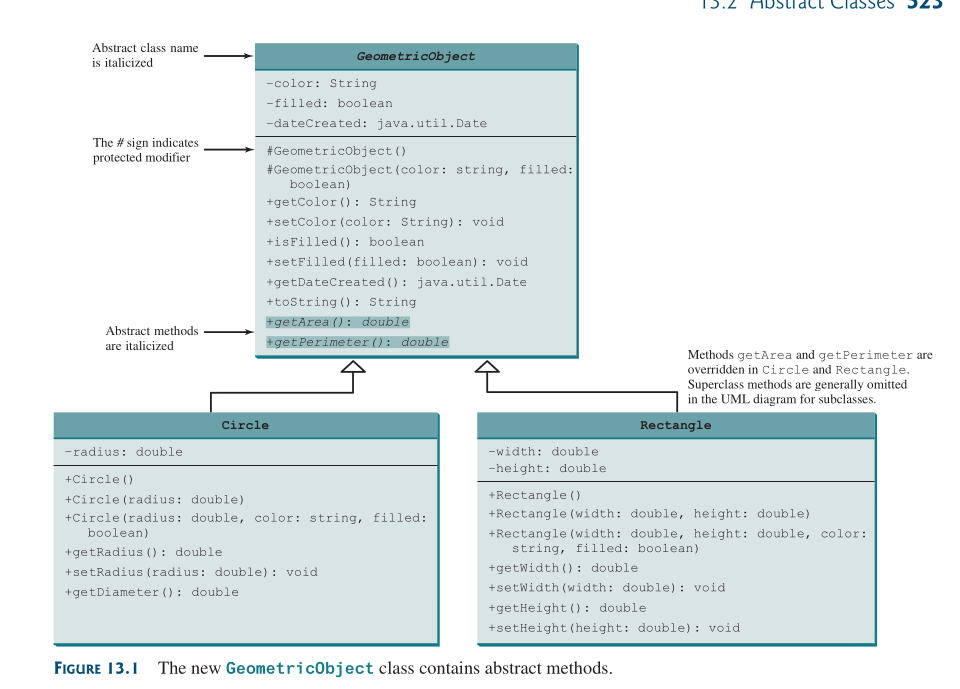

:PROPERTIES:
:ID:       a1091361-fe51-4d9a-97dc-1178bc14226e
:END:
#+title: Introducing Abstract Classes
#+property: header-args :tangle code/ocp/6/introducing_abstract_classes.java

* Introducing Abstract Classes

An ~abstract class~ *cannot* be used to *create* =objects=.

An ~abstract class~ is a class declared with the ~abstract~ modifier that *cannot* be *instantiated* directly and may contain [[id:3e6ed9f7-a719-4f68-94f0-29cb4914ebf2][abstract methods]] that are implemented in concrete subclasses.

An ~abstract class~ is most commonly used when you want *another* ~class~ to *inherit* properties of a particular class, but you want the ~subclass~ to fill in some of the *implementation details*.

In the [[id:ef9940e7-a139-4cd1-91eb-263c38bec1ad][inheritance hierarcy]], =classes= become *more* specific and *concrete* with each *new* =subclass=.

If you move from a subclass back up to a superclass, the classes become more *general* and *less* *specific*.

=Class= design should ensure a =superclass= contains *common* *features* of its =subclasses=.

Sometimes, a =superclass= is so abstract it cannot be used to create any *specific* =instances=.

Such a class is referred to as an *abstract class*.

** Example

#+BEGIN_SRC java
public abstract class Canine {}

public class Wolf extends Canine {}
public class Fox extends Canine {}
public class Coyote extends Canine {}
#+END_SRC

An ~abstract class~ can contain [[id:3e6ed9f7-a719-4f68-94f0-29cb4914ebf2][abstract methods]].

An [[id:3e6ed9f7-a719-4f68-94f0-29cb4914ebf2][abstract methods]] is a method declared with the ~abstract~ modifier that does *not* define a body.
Put another way, an [[id:3e6ed9f7-a719-4f68-94f0-29cb4914ebf2][abstract methods]] *forces* ~subclasses~ to *override* the method.

Why would we want this? [[id:737de690-076a-4f7f-91f5-606587c75882][polymorphism]], of course!

By declaring a method ~abstract~, we can *guarantee* that some version will be available on an =instance= without having to specify what that version is in the ~abstract parent~ class

** Example

#+BEGIN_SRC java
public abstract class GeometricObjectv2 {
    private String color = "white";
    private boolean filled;
    private java.util.Date dateCreated;

    protected GeometricObjectv2() {
        dateCreated = new java.util.Date();
    }

    protected GeometricObjectv2(String color, boolean filled) {
        dateCreated = new java.util.Date();
        this.color = color;
        this.filled = filled;
    }

    public String getColor() {
        return color;
    }

    public void setColor(String color) {
        this.color = color;
    }

    public boolean isFilled() {
        return filled;
    }

    public void setIsFilled(boolean filled) {
        this.filled = filled;
    }

    public java.util.Date getDateCreated() {
        return dateCreated;
    }

    @Override
    public String toString() {
        return "created on " + dateCreated + "\ncolor: " + color + " and filled: " + filled;
    }

    public abstract double getArea();

    public abstract double getPerimeter();

    public static void main(String[] args) {

    }
}
#+END_SRC
Abstract classes are denoted using the abstract modifier in the
class header.

In [[id:3ef13e32-b3fa-4c2f-9fa1-b1b0f359477a][UML]] the names of ~abstract classes~ and their ~abstract methods~ are /italicized/:

#+ATTR_ORG: :width 900

The =constructor= in the ~abstract class~ is defined as [[id:2085746a-5d79-403a-a417-5a0ef14f9933][protected]] because it is used only by =subclasses=.

When you create an instance of a *concrete* *subclass*, its =superclass’s= constructor is *invoked* to initialize *data* *fields* defined in the =superclass=.

The ~GeometricObject~ *abstract class* defines the common features (*data* and *methods*) for =geometric objects= and provides appropriate =constructors=.

Because you *don’t* know how to compute areas and perimeters of =geometric objects=, ~getArea()~ and ~getPerimeter()~ are defined as [[id:3e6ed9f7-a719-4f68-94f0-29cb4914ebf2][Abstract Methods]].

These methods are implemented in the =subclasses=.

The *implementation* of ~Circle~ and ~Rectangle~:

#+BEGIN_SRC java
public class Circle extends GeometricObject {
// Same as lines 2−47 in Listing 11.2, so omitted
}

public class Rectangle extends GeometricObject {
// Same as lines 2−49 in Listing 11.3, so omitted
}
#+END_SRC

** Rules

- ~Abstract classes~ are like regular =classes=, but you *cannot* create =instances= of ~abstract classes~ using the ~new~ operator.

- Only ~instance~ methods can be marked *abstract* within a =class=, not *variables*, *constructors*, or *static methods*.

- [[id:3e6ed9f7-a719-4f68-94f0-29cb4914ebf2][Abstract methods]] can only be declared in an ~abstract class~.

- A *non­abstract* ~class~ that extends an ~abstract class~ *must* /implement/ all *inherited* [[id:3e6ed9f7-a719-4f68-94f0-29cb4914ebf2][abstract methods]].

- *Overriding* a [[id:3e6ed9f7-a719-4f68-94f0-29cb4914ebf2][abstract methods]] follows the existing rules for [[id:c67b24a4-82f7-4423-83a9-75fc1c566166][overriding methods]].

** Why Abstract Methods?

You may be wondering what advantage is gained by defining the methods ~getArea()~ and ~getPerimeter()~ as abstract in the ~GeometricObject~ =class=.

*** Example
The code below shows the benefits of defining them in the ~GeometricObject~ class.

The program creates two =geometric objects=, a ~circle~ and a ~rectangle~, invokes the ~equalArea~ method to check whether they *have* *equal* ~areas~, and invokes the ~displayGeometricObject~ method to *display* them.

#+BEGIN_SRC java
public class TestGeometricObject {
    public static void main(String[] args) {
        // Create two geometric objects
        GeometricObject geoObject1 = new Circle(5);
        GeometricObject geoObject2 = new Rectangle(5, 3);

        System.out.println("The two objects have the same area? " + equalArea(geoObject1, geoObject2));

        // Display circle
        displayGeometricObject(geoObject1);
        // Display rectangle
        displayGeometricObject(geoObject2);
    }

    // A method for comparing the areas of two geometric objects
    public static boolean equalArea(GeometricObject object1, GeometricObject object2) {
        return object1.getArea() == object2.getArea();
    }

    // A method for displaying a geometric object
    public static void displayGeometricObject(GeometricObject object) {
        System.out.println();
        System.out.println("The area is " + object.getArea());
        System.out.println("The perimeter is " + object.getPerimeter());
    }
}
#+END_SRC

**** Output

#+BEGIN_SRC java
The two objects have the same area? false
The area is 78.53981633974483
The perimeter is 31.41592653589793
The area is 15.0
The perimeter is 16.0
#+END_SRC

The methods ~getArea()~ and ~getPerimeter()~ defined in the ~GeometricObject~ class are *overridden* in the ~Circle~ and ~Rectangle class~.

The statements
#+BEGIN_SRC java
GeometricObject geoObject1 = new Circle(5);
GeometricObject geoObject2 = new Rectangle(5, 3);
#+END_SRC

create a new ~circle~ and ~rectangle~ and assign them to the variables =geoObject1= and =geoObject2=.

These two variables are of the ~GeometricObject~ type.

When invoking ~equalArea(geoObject1, geoObject2)~:
- The ~getArea()~ method defined in the =Circle class= is used for ~object1.getArea()~ since ~geoObject1~ is-a =circle=.
- The ~getArea()~ method defined in the =Rectangle class= is used for ~object2.getArea()~ since ~geoObject2~ is-a =rectangle=.

Similarly:
- when invoking ~displayGeometricObject(geoObject1)~ the methods ~getArea()~ and ~getPerimeter()~ defined in the =Circle class= are used.
- when invoking ~displayGeometricObject(geoObject2)~ the methods ~getArea()~ and ~getPerimeter()~ defined in the =Rectangle class= are used.

**** Note
- The *JVM* *dynamically* *determines* which of these /methods/ to *invoke* at *runtime*, depending on the ~actual object~ that invokes the /method/.
- You could *not* define the ~equalArea~ method for comparing whether two ~geometric objects~ have the *same* *area* if the ~getArea~ method was *not* defined in ~GeometricObject~ (since ~object1~ and ~object2~ are of the ~GeometricObject~ type).

** Error

If you attempt to *instantiate* it, the *compiler* will report an *exception*:

#+BEGIN_SRC java
abstract class Alligator {
    public static void main(String... food) {
        var a = new Alligator(); // DOES NOT COMPILE
    }
}
#+END_SRC

An abstract class can be *initialized*, but only as part of the *instantiation* of a *non-abstract* ~subclass~.
