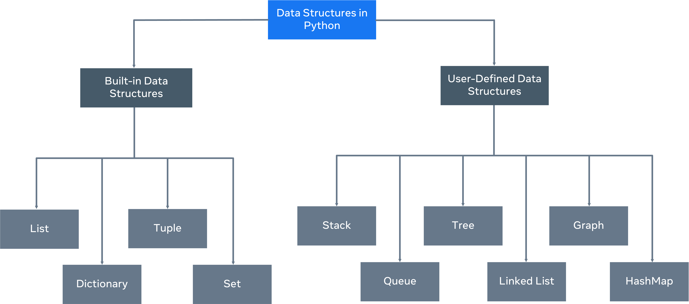

:PROPERTIES:
:ID:       12d4cc9e-a619-4db5-8576-55e7f441bf97
:END:
#+title: DataStructures In Python

#+ATTR_ORG: :width 900

* Built-In (Non-primitive)
** [[id:156dcdea-4f6c-440e-a23a-1165e466a5e0][List]]
** [[id:5bd3c434-a989-45e6-82c7-82cf2df1052e][Dictionary]]
** [[id:ddb24855-6404-4cac-bc81-5f36570c7499][Tuple]]
** [[id:e4e95438-1564-4e48-a2fb-790dd2d15212][Set]]

* (User defined) Custom
** [[id:182cfd63-4325-48a6-ac48-8070836b809a][Stacks]]
** [[id:e6650a4a-53ad-4d0c-bd60-fed17895df6e][Queues]]
** [[id:93680f95-13fd-4849-bd3a-0a9de7778f88][Trees]]
