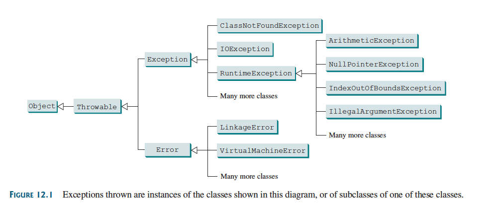

:PROPERTIES:
:ID:       e9b43d53-8367-4ab6-9416-f852b3efb73d
:END:
#+title: Exception Types

* Exception Types

*Exceptions* are =objects=, and =objects= are defined using =classes=.

The *root class* for =exceptions= is ~java.lang.Throwable~.

#+ATTR_ORG: :width 900

The ~Throwable~ class is the *root* of /exception/ =classes=.

*All* Java exception classes /inherit/ directly or indirectly from ~Throwable~.

You can create your own *exception* =classes= by /extending/ ~Exception~ or a /subclass/ of ~Exception~.

The exception classes can be *classified* into three major types:

** 1. System Errors

=System errors= are *thrown* by the *JVM* and are represented in the ~Error~ class.
- The ~Error~ class describes internal system errors, though such errors rarely occur.

(If one does, there is /little/ you can do beyond notifying the user and trying to terminate the program gracefully).

*** Examples

| Class               | Reasons for Exception                                                                                   |
|---------------------+---------------------------------------------------------------------------------------------------------|
| LinkageError        | A class depends on another class, but that class has changed incompatibly after the first was compiled. |
| VirtualMachineError | The JVM is broken or has run out of the resources it needs to continue operating.                       |

** 2. Exceptions

*Exceptions* are represented in the ~Exception~ class, which describes *errors* caused by /your/ program and by /external circumstances/.
- These *errors* can be /caught/ and handled by your program.

*** Examples

| Class                  | Reasons for Exception                                                                                                                    |
|------------------------+------------------------------------------------------------------------------------------------------------------------------------------|
| ClassNotFoundException | Attempt to use a class that does not exist (e.g., running a nonexistent class or missing class files at runtime).                        |
| IOException            | Related to input/output operations (e.g., invalid input, reading past end of file, opening a nonexistent file). Includes subclasses like |
|                        | InterruptedIOException, EOFException, and FileNotFoundException.                                                                         |

** 3. Runtime Exceptions

*Runtime exceptions* are represented in the ~RuntimeException~ class, which describes *programming errors*

- Bad Casting
- Accessing an out-of-bounds array
- Numeric Errors

*Runtime exceptions* normally indicate /programming errors/.

*** Examples

| Class                     | Reasons for Exception                                                                  |
|---------------------------+----------------------------------------------------------------------------------------|
| ArithmeticException       | Dividing an integer by zero (floating-point arithmetic does not throw this exception). |
| NullPointerException      | Attempt to access an object through a null reference variable.                         |
| IndexOutOfBoundsException | Index used for an array (or similar structure) is out of range.                        |
| IllegalArgumentException  | A method receives an argument that is illegal or inappropriate.                        |

** [[id:2086f93d-52b5-400f-9f27-ddd0483cb168][Checked vs Unchecked Exceptions]]
