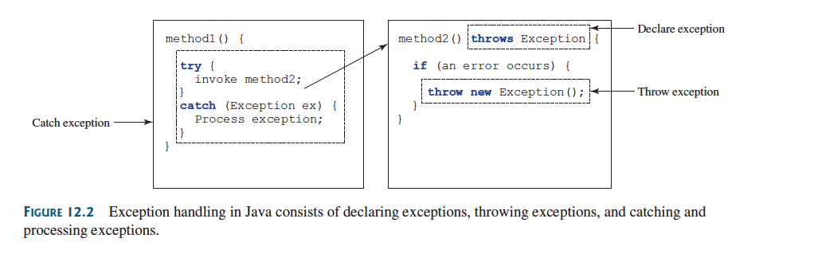

:PROPERTIES:
:ID:       712fb192-0dca-4165-958e-63d6a83ec943
:END:
#+title: Declaring, Throwing and Catching Exceptions

* Declaring, Throwing and Catching Exceptions

A /handler/ for an *exception* is found by propagating the *exception* backward through a *chain* of =method calls=, starting from the current =method=.

Java’s *exception-handling* model is based on /three operations/:
- *Declaring*
- *Throwing*
- And *Catching*

#+ATTR_ORG: :width 900

** Declaring Exceptions

In Java, the statement currently being *executed* belongs to a =method=.

The Java /interpreter/ invokes the =main method= to start executing a program.

Every =method= must state the types of *checked exceptions* it might throw.

This is /known/ as *declaring exceptions*.

Because *system errors* and *runtime errors* can happen to any code, Java does *not* require that you declare ~Error~ and ~RuntimeException~ (*unchecked exceptions*) explicitly in the method.

However, all other exceptions *thrown* by the method must be /explicitly/ declared in the *method header* so the /caller/ of the =method= is *informed* of the ~exception~.

To declare an exception in a method, use the ~throws~ keyword in the *method header*.

*** Example

#+BEGIN_SRC java
public void myMethod() throws IOException
#+END_SRC

The ~throws~ keyword indicates ~myMethod~ might *throw* an ~IOException~.

If the method might throw *multiple exceptions*, add a /list/ of the *exceptions*

#+BEGIN_SRC java
public void myMethod() throws Exception1, Exception2, ..., ExceptionN
#+END_SRC

**** Note

If a =method= does *not* declare *exceptions* in the =superclass=, you *cannot* /override/ it to declare *exceptions* in the =subclass=.

** Throwing Exceptions

A program that *detects* an *error* can create an instance of an appropriate ~exception~ type and /throw/ it.

This is /known/ as *throwing an exception*.

*** Example

Suppose the program detects that an argument passed to the method violates the method contract (e.g., the argument must be nonnegative, but a negative argument is passed).

The program /can/ create an =instance= of ~IllegalArgumentException~ and *throw* it:

#+BEGIN_SRC java
IllegalArgumentException ex = new IllegalArgumentException("Wrong Argument");
throw ex;
#+END_SRC

OR

#+BEGIN_SRC java
throw new IllegalArgumentException("Wrong Argument");
#+END_SRC

*** Note

~IllegalArgumentException~ is an *exception* =class= in the =Java API=.

In general, each exception class in the Java API has at least two constructors: a ~no-arg constructor~ and a ~constructor~ with a =String= argument that describes the exception (Exception message).

Message can be /obtained/ by invoking ~getMessage()~ from an =exception object=.

- The *keyword* to /declare/ an *exception* is ~throws~, and the *keyword* to /throw/ an *exception* is ~throw~.

** Catching Exceptions

When an exception is /thrown/, it can be /caught/ and handled in a ~try-catch block~

*** Example
#+BEGIN_SRC java
try {
    // Statements that may throw exceptions
} catch (Exception1 exVar1) {
    // handler for excpetion1;
} catch (Exception2 exVar2) {
    // handler for excpetion2;
}
// ...
 catch (ExceptionN exVarN) {
    // handler for excpetionN;
}
#+END_SRC

If *no* =exceptions= arise during the execution of the ~try block~, the ~catch blocks~ are /skipped/.

If *one* of the statements inside the ~try block~ /throws/ an *exception*, Java skips the remaining statements and starts the process of finding the code to *handle the exception*.

The code that handles the exception is /called/ the *exception handler* (found by propagating the *exception* backward through a chain of method calls, starting from the current method).

Each ~catch block~ is /examined/ from first to last to see whether the type of the =exception object= is an *instance* of the =exception class= in the ~catch block~.

If so, the =exception object= is /assigned/ to the variable declared and the code in the ~catch block~ is *executed*.

If *no* handler is /found/, Java *exits* this =method=, passes the *exception* to the =method’s caller=, and continues the same process to find a /handler/.

If *no* handler is /found/ in the chain of methods being invoked, the program terminates and *prints an error message on the console*.

The process of finding a /handler/ -> *catching an exception*.
