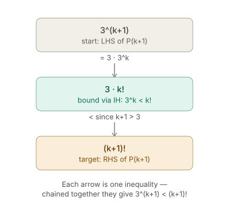

:PROPERTIES:
:ID:       544e6c47-de51-4e38-a173-c8d69265c3d5
:END:
#+title: More Induction Proof Worked Examples
#+filetags: :F91MC_practice:

* More Induction Proof Worked Examples

** Example 1: bounded sequence $a_n \leq 2$

*** Statement

Let $\{a_n\}$ be the sequence defined by $a_1 = 1$ and
$$a_{n+1} = \sqrt{2 + a_n}, \quad n \geq 1.$$
Prove by induction that $a_n \leq 2$ for all positive integers $n$.

*** Setup

Let $P(n)$ be the statement: $a_n \leq 2$.

*** Base case

$a_1 = 1$, and $1 \leq 2$, so $P(1)$ is true.

*** Inductive hypothesis

Assume $P(k)$ holds, i.e. $a_k \leq 2$.

*** Target

Show $P(k+1)$, i.e. $a_{k+1} \leq 2$.

*** Proof of target

Starting from the hypothesis:
$$a_k \leq 2$$

Add $2$ to both sides (to match the $2 + a_k$ under the root in
the recurrence):
$$a_k + 2 \leq 4$$

Take the square root of both sides:
$$\sqrt{2 + a_k} \leq \sqrt{4} = 2$$

But $\sqrt{2 + a_k} = a_{k+1}$ by the recurrence, so:
$$a_{k+1} \leq 2$$

This is exactly the target, so $P(k+1)$ is true.

*** Conclusion

By induction, $a_n \leq 2$ for all positive integers $n$. $\blacksquare$

*** Method note

Identify the *target* ($a_{k+1} \leq 2$) right after stating the inductive hypothesis, before doing any algebra.

Then work forward from the hypothesis, applying only order-preserving operations (adding a constant, taking square roots of nonnegative quantities), steering the expression until it matches the shape
needed to invoke the recurrence and land on the target.

** Example 2: $2^n < n!$ for $n \geq 4$

*** Note on factorials

$n!$ means $n \times (n-1) \times \cdots \times 2 \times 1$. By
convention $0! = 1$. E.g. $4! = 24$, $7! = 5040$.

*** Statement

Prove by induction that $2^n < n!$ for $n \geq 4$.

*** Setup

Let $P(n)$ be the statement: $2^n < n!$.

*** Base case

$P(4)$: check $2^4 < 4!$.
$$16 < 24$$
True, so $P(4)$ holds.

*** Inductive hypothesis

Assume $k \geq 4$ and $P(k)$ holds, i.e. $2^k < k!$.

*** Target

Show $P(k+1)$, i.e. $2^{k+1} < (k+1)!$.

*** Proof of target

Rewrite the left side of the target using exponent rules (always
true, no inequality involved yet):
$$2^{k+1} = 2 \times 2^k$$

Now bring in the hypothesis $2^k < k!$. Multiply *both sides* by
$2$:
$$2 \times 2^k < 2 \times k!$$

The left side is exactly $2^{k+1}$ (from the rewrite above), so:
$$2^{k+1} < 2(k!)$$

That's one link in the chain.

To reach the target we still need to connect $2(k!)$ to $(k+1)!$. Write $(k+1)! = (k+1) \times k!$.

Since $k \geq 4$, we have $k + 1 \geq 5 > 2$, so:
$$2(k!) < (k+1)(k!) = (k+1)!$$

Chaining the two links together:
$$2^{k+1} < 2(k!) < (k+1)!$$

so $2^{k+1} < (k+1)!$ — exactly the target, so $P(k+1)$ is true.

*** Conclusion

By induction, $2^n < n!$ for all $n \geq 4$. $\blacksquare$

*** Method note

Two-link chain: first rewrite the target's LHS so the hypothesis
can be applied directly (via a *true, non-inequality* algebraic
identity — $2^{k+1} = 2 \times 2^k$); then bridge the resulting
expression ($2(k!)$) to the target's RHS ($(k+1)!$) using the
constraint on $k$ (here $k \geq 4$ is what makes $k+1 > 2$, which
is what the second link needs).
** Example 3:
*** Statement

Let $P(n)$ be the statement

\[
1 + 2 + \cdots + n = \frac{n(n+1)}{2}.
\]

*** Base case

$P(1)$:

\[
\underbrace{1}_{\text{LHS}} = \underbrace{\frac{1(1+1)}{2}}_{\text{RHS}} = 1 \quad \checkmark
\]

*** Inductive hypothesis

Assume $P(k)$ is true for some particular but arbitrary natural number $k$:

\[
1 + \cdots + k = \frac{k(k+1)}{2}.
\]

*** Target: P(k+1)

Goal — substitute $n = k+1$ everywhere in $P(n)$:

\[
1 + \cdots + k + (k+1) = \frac{(k+1)(k+2)}{2}.
\]

*** Calculation

Start from the LHS of $P(k+1)$, group the first $k$ terms, and substitute the inductive hypothesis:

\[
\underbrace{(1 + \cdots + k)}_{= \frac{k(k+1)}{2} \text{ by IH}} + (k+1)
= \frac{k(k+1)}{2} + (k+1)
= \frac{k(k+1) + 2(k+1)}{2}
= \frac{(k+1)(k+2)}{2}.
\]

This matches the target RHS of $P(k+1)$.

*** Conclusion

$P(1)$ holds, and $P(k) \implies P(k+1)$ for all $k$. By induction, $P(n)$ holds for all natural numbers $n$.
** Example 4:
*** Setup

Let $\{a_n\}$ be the sequence defined by $a_1 = 3$ and

\[
a_{n+1} = 5a_n - 8, \quad n \geq 1.
\]

Let $P(n)$ be the statement

\[
a_n = 5^{n-1} + 2.
\]

*** P(1)

\[
P(1): \quad 5^{1-1} + 2 = 1 + 2 = 3
\]

Since $a_1 = 3$, this matches. $P(1)$ is *true*.

*** P(2)

Claim (plug $n=2$ into $P(n)$):

\[
P(2): \quad 5^{2-1} + 2 = 5 + 2 = 7
\]

Actual value, from the recurrence with $n=1$:

\[
a_2 = 5a_1 - 8 = 5(3) - 8 = 15 - 8 = 7
\]

These match. $P(2)$ is *true*.

*** P(3)

Claim (plug $n=3$ into $P(n)$):

\[
P(3): \quad 5^{3-1} + 2 = 5^2 + 2 = 27
\]

Actual value, from the recurrence with $n=2$:

\[
a_3 = 5a_2 - 8 = 5(7) - 8 = 35 - 8 = 27
\]

These match. $P(3)$ is *true*.

*** Pattern

Each $P(n)$ is checked by:
1. Computing the *claim*: substitute $n$ into $a_n = 5^{n-1}+2$.
2. Computing the *actual* value: apply the recurrence $a_{n+1} = 5a_n - 8$ using the previous term.
3. Comparing the two.

This term-by-term checking is what a full induction proof would generalise: assume $P(k)$ (i.e. $a_k = 5^{k-1}+2$), then use the recurrence to show $P(k+1)$ follows.
** Example 5:
*** Statement

Let $P(n)$ be the statement

\[
3^n < n!, \quad n \geq 7.
\]

*** Base case

$P(7)$:

\[
3^7 = 2187 < 5040 = 7! \quad \checkmark
\]

*** Inductive hypothesis

Assume $k \geq 7$ and $P(k)$ is true:

\[
3^k < k!.
\]

*** Target: P(k+1)

Goal:

\[
3^{k+1} < (k+1)!.
\]

*** Calculation

Start from $3^{k+1}$, split off a factor of 3, and apply the inductive hypothesis:

\[
3^{k+1} = 3\cdot 3^k < 3\cdot k! \quad \text{(by IH)}
\]

Since $k \geq 7$, we have $k+1 \geq 8 > 3$. Multiplying both sides of $k+1 > 3$ by $k!$ (positive) gives:

\[
3\cdot k! < (k+1)\cdot k! = (k+1)!.
\]

Chaining the two inequalities:

\[
3^{k+1} = 3\cdot 3^k < 3\cdot k! < (k+1)!.
\]

This matches the target: $3^{k+1} < (k+1)!$.

*** Conclusion

$P(7)$ holds, and $P(k) \implies P(k+1)$ for all $k \geq 7$. By induction, $P(n)$ holds for all natural numbers $n \geq 7$.

*** Method

That's the whole proof as a chain: you don't jump straight from $3^{k+1}$ to $(k+1)!$ - you build a bridge through an intermediate expression, using the IH for one hop and the constraint ($k \geq 7$) for the other.

The general pattern for *inequality inductions*: rewrite the target's LHS to expose the IH, swap in the IH's bound (one $<$), then find a second inequality - usually from the problem's constraint - that closes the gap to the target's RHS (a second $<$).

Chain them and you're done.

#+ATTR_ORG: :width 900

** Example 6:
*** Statement

Let $\{a_n\}$ be the sequence defined by $a_1 = x$, where $3 < x < 4$, and

\[
a_{n+1} = \frac{a_n^2 + 12}{7}, \quad n \geq 1.
\]

Let $P(n)$ be the statement

\[
3 < a_n < 4.
\]

*** Base case

$P(1)$:

\[
3 < a_1 < 4
\]

Since $a_1 = x$ and $3 < x < 4$ is given, $P(1)$ is true.

*** Inductive hypothesis

Assume $P(k)$ is true for some $k \geq 1$:

\[
3 < a_k < 4.
\]

*** Target: P(k+1)

Goal:

\[
3 < a_{k+1} < 4.
\]

*** Calculation

Two bounds are needed, both from substituting the recurrence $a_{k+1} = \dfrac{a_k^2+12}{7}$.

**Upper bound** ($a_{k+1} < 4$): since $a_k < 4$ and $a_k > 0$, squaring gives

\[
a_k^2 < 16.
\]

Add 12, then divide by 7 (both operations preserve $<$ since 7 is positive):

\[
a_k^2 + 12 < 28 \quad\Rightarrow\quad \frac{a_k^2+12}{7} < 4 \quad\Rightarrow\quad a_{k+1} < 4.
\]

**Lower bound** ($a_{k+1} > 3$): since $a_k > 3$ and $a_k > 0$, squaring gives

\[
a_k^2 > 9.
\]

Add 12, then divide by 7:

\[
a_k^2 + 12 > 21 \quad\Rightarrow\quad \frac{a_k^2+12}{7} > 3 \quad\Rightarrow\quad a_{k+1} > 3.
\]

Combining both bounds:

\[
3 < a_{k+1} < 4.
\]

This matches the target $P(k+1)$.

*** Conclusion

$P(1)$ holds, and $P(k) \implies P(k+1)$ for all $k \geq 1$. By induction, $P(n)$ holds for all natural numbers $n$: $3 < a_n < 4$.
